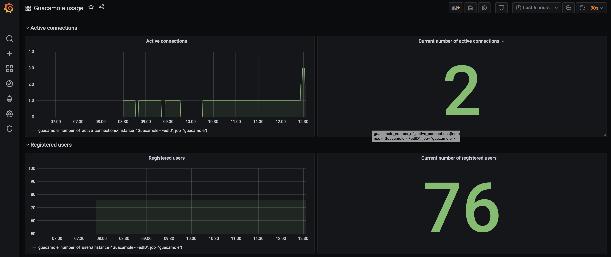

# Guacamole Exporter

Export [Guacamole](https://guacamole.apache.org) statistics to [Prometheus](https://prometheus.io).

Metrics are retrieved using the Guacamole REST API. As the official documentation currently does not cover this API, [ridvanaltun](https://github.com/ridvanaltun/guacamole-rest-api-documentation)'s attempt at documenting was most useful.

To run it:

    go build
    ./guacamole_exporter [flags]

## Exported Metrics
| Metric | Description |
| ------ | ------- |
| guacamole_up | Was the last Guacamole query successful |
| guacamole_connection_history_total | The total number of established connections |
| guacamole_number_of_users  | The current number of registered users |
| guacamole_number_of_active_connections| The current number of active connections |

## Flags
    ./guacamole_exporter --help

| Flag | Description | Default |
| ---- | ----------- | ------- |
| web.listen-address | Address to listen on for telemetry | `:9623` |
| web.telemetry-path | Path under which to expose metrics | `/metrics` |

## Env Variables

Use a .env file in the local folder, or /etc/sysconfig/guacamole_exporter when running on a Linux distro with SystemD
```
GUACAMOLE_ENDPOINT=https://guacamole.yourcompane.com
GUACAMOLE_USERNAME=admin
GUACAMOLE_PASSWORD=admin
GUACAMOLE_DATASOURCE=mysql
```

## Grafana dashboard

An example dashboard can be found [here](dashboard/guacamole_usage_dashboard.json). After loading it into your Grafana instance, and assuming your Prometheus datastream is scraping your guacamole_exporter, you should get something like this:



## Deployment

I have written an [Ansible role](https://github.com/tschoonj/ansible-role-guacamole-exporter) to facilitate installation on Linux machines. It works very well when combined with the [Cloudalchemy Ansible roles](https://github.com/cloudalchemy) for installing Grafana, Prometheus, Node exporter etc.

## Acknowledgements

This exporter is strongly inspired by the [mirth_channel_exporter](https://github.com/teamzerolabs/mirth_channel_exporter), which gives a very clear and concise example of how to write a Prometheus exporter in Go, and convinced me that it was feasible to write one myself in just a couple of hours even though I had never written a line of Go before...
